# Standard Operating Procedure

This document helps in using phase transition system for running transition temperature experiments insisde a thermally insulated box.

### Setting up Instruments

Start Nitrogen supply by rotating the ```gas use``` valve.

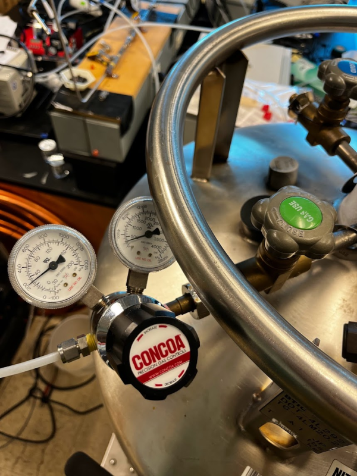

Turn on ```Phase Transition System``` panel mount. It should turn on the temperature controller, vacuum pump and water bath outside the insulated box, and POPS, DMA and circulating fans inside the insulated box. Make sure that there is water inside the water bath and is being actively circulated.

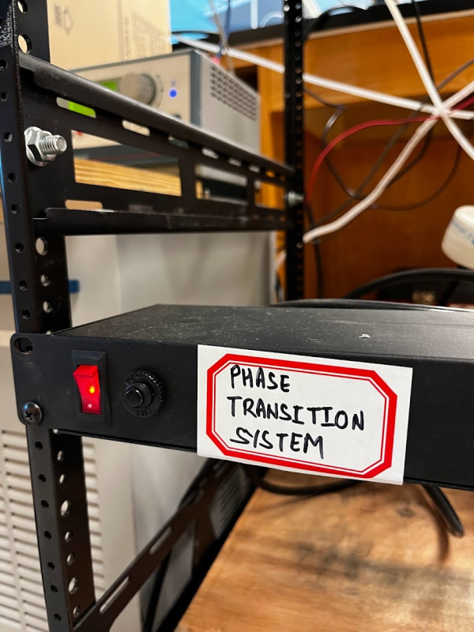

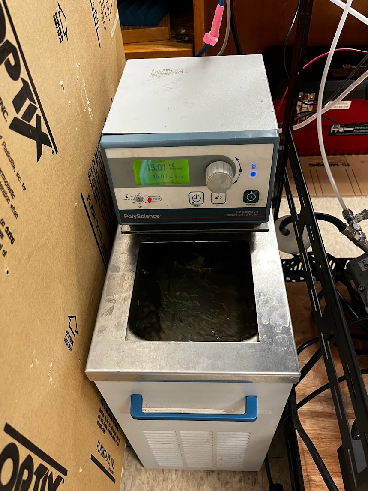

Check the flows. The inlet flow to the DMA should be around 0.4-0.5 litre per minute(lpm) while sheath air should be ~4.5 lpm.

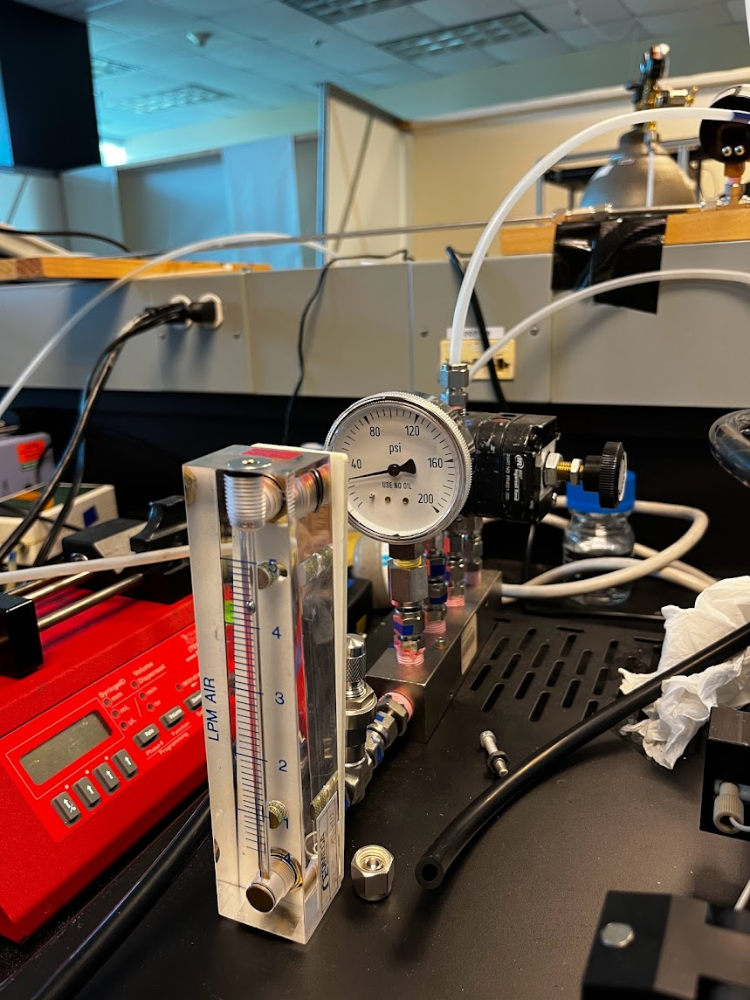

Turn on ```Temperature Controller```

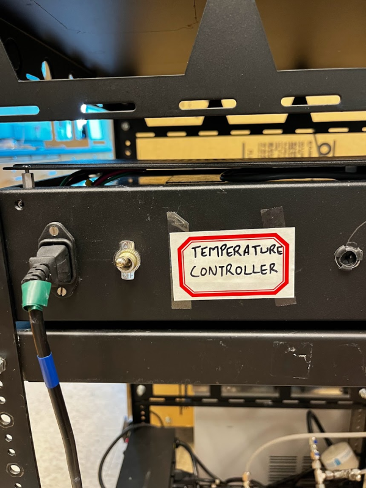

### Starting Software

Run ```main.jl``` from the directory ```phaseDAQ/src/``` either using VSCode or by running the following command in terminal:

```[aerosol@localhost ~]$ cd /home/aerosol/phaseDAQ/src```

```[aerosol@localhost src]$ julia --project main.jl``` 

It takes a few seconds for UI to pop up. Temperature readings from the controller, and Temperature and RH readings from DMA should update every 2 seconds.

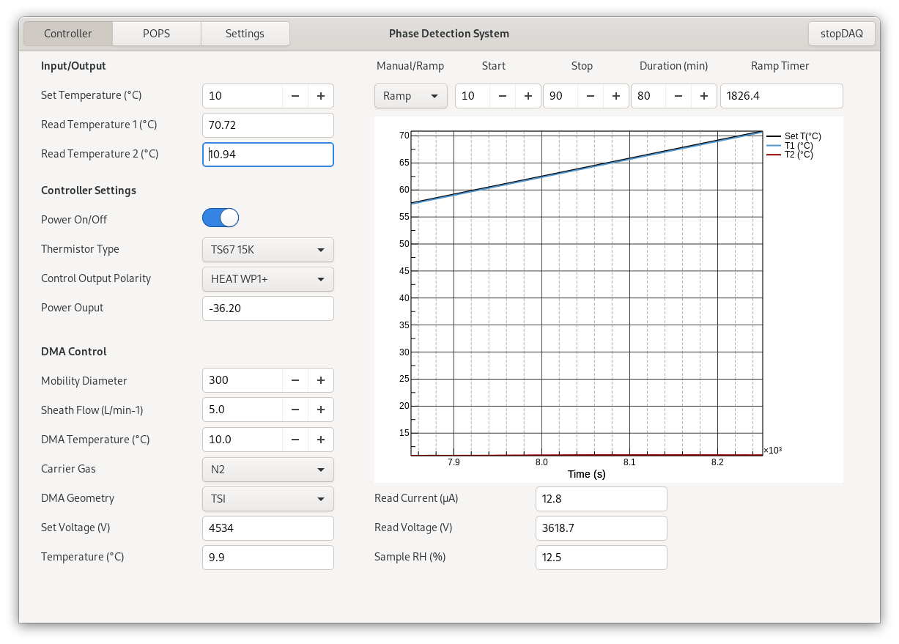

Switch to ```Settings``` tab to make sure that POPS UDP Status is being updated.

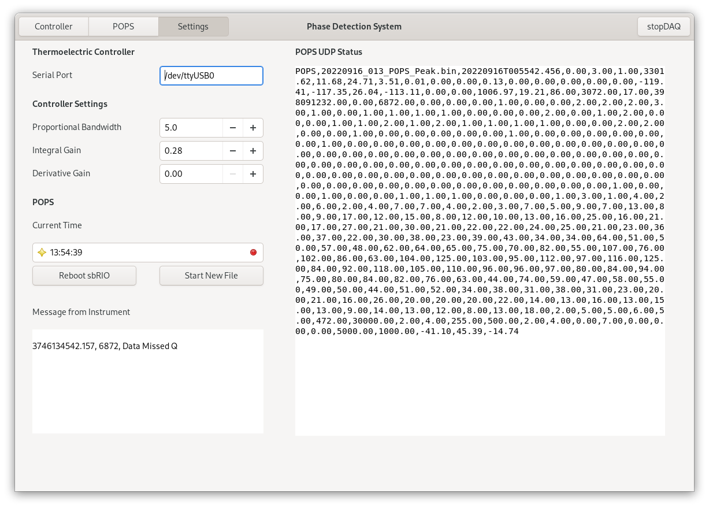

POPS flow in ```POPS``` tab should be ~0.15 cc/s at room temperature.

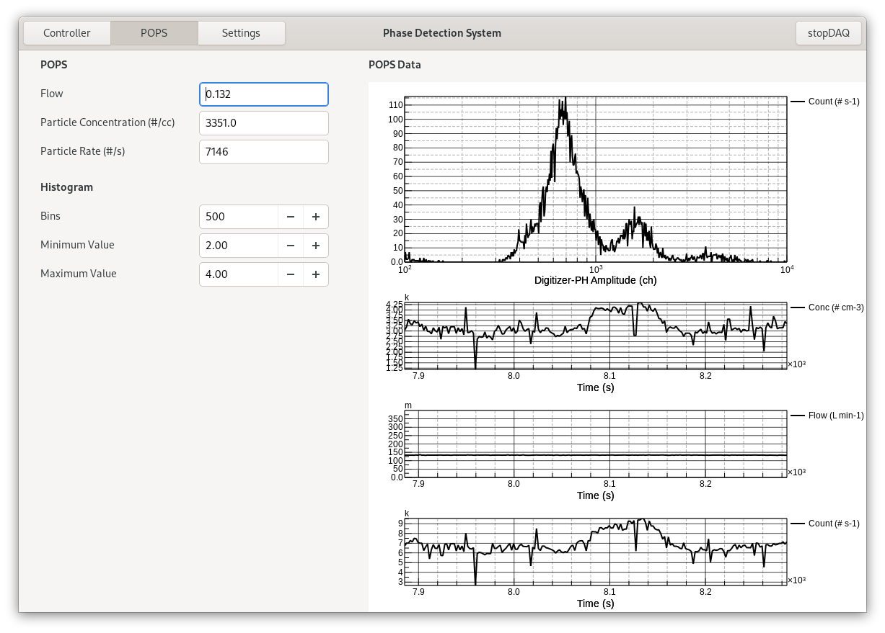

Let the system stabilize until RH reaches ~5-6%.
Start the ```chiller``` and close the cover of insulated box. Let the system stabilize after setting the desired temperature of chiller.

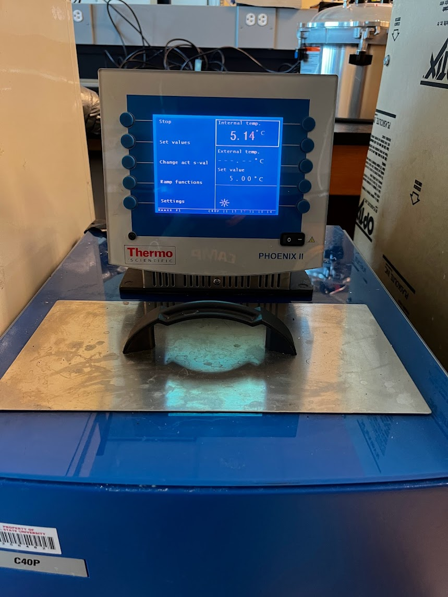

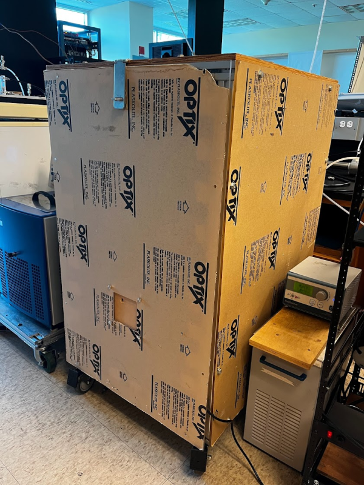

Change ```DMA Temperature``` to the ```Temperature``` reading from DMA. Monitor increase in RH as it should not become too high (>15%).

### Running Experiments

Start aerosol injection.

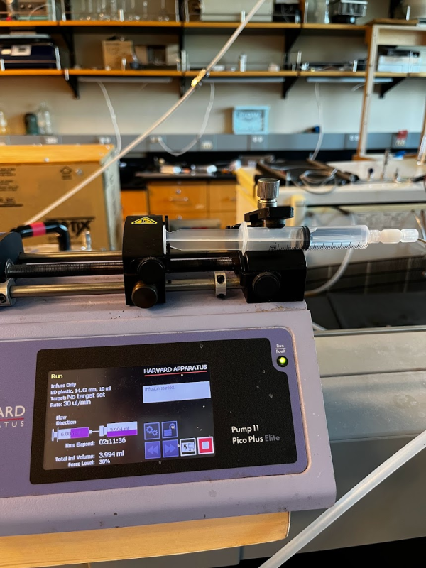

Let the system equilibrate by looking at particle rate under ```POPS``` tab. Particle rate should be below 10000 #/s at all the times. No data will be saved for particle rate greater than 10000 #/s. Changing any of the value under Histogram column will generate a new file. Swtich to ```Controller``` tab and set start and stop values for temperature and duration of ramp. Select ramp from drop down button and power on the controller. Note down current time.
All the data is saved locally to the computer. POPS data is also saved to the attached USB stick while USB's blue light is blinking.

### Shutting Down


### Data Analysis

